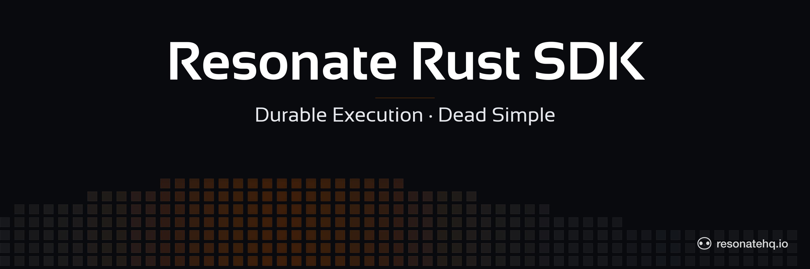
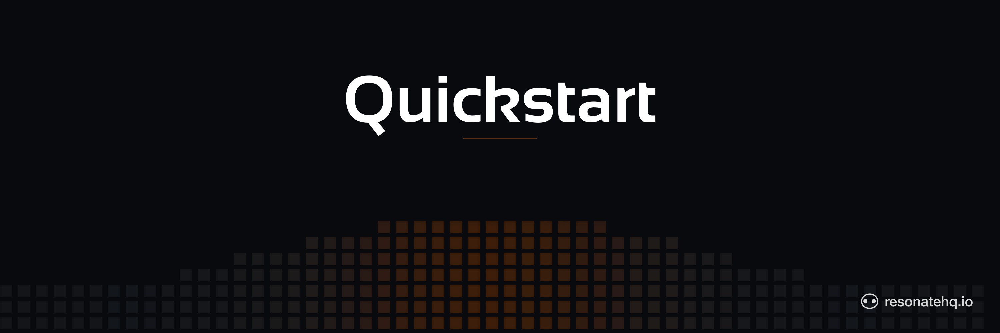

<p align="center">
  
</p>

# Resonate Rust SDK

[](https://github.com/resonatehq/resonate-sdk-rs/actions/workflows/ci.yml)
[](https://opensource.org/licenses/Apache-2.0)

> **Early development.** APIs may change between releases.

## About this component

The Resonate Rust SDK enables developers to build reliable and scalable cloud applications in Rust. Built on [tokio](https://tokio.rs), it gives you durable execution with automatic recovery, idempotency, and distributed coordination.

- [How to contribute to this SDK](./CONTRIBUTING.md)
- [Evaluate Resonate for your next project](https://docs.resonatehq.io/evaluate/)
- [Example application library](https://github.com/resonatehq-examples)
- [Distributed Async Await — the concepts that power Resonate](https://www.distributed-async-await.io/)
- [Join the Discord](https://resonatehq.io/discord)
- [Subscribe to the Journal](https://journal.resonatehq.io/subscribe)
- [Follow on X](https://x.com/resonatehqio)
- [Follow on LinkedIn](https://www.linkedin.com/company/resonatehqio)
- [Subscribe on YouTube](https://www.youtube.com/@resonatehqio)

## Quickstart



1. Install the Resonate Server & CLI

```shell
brew install resonatehq/tap/resonate
```

2. Install the Resonate SDK

The SDK is currently git-only (not yet on crates.io). Add it as a git dependency, renaming the package to `resonate` for shorter imports — the convention used in our [examples](https://github.com/resonatehq-examples) and [docs](https://docs.resonatehq.io/develop/rust):

```shell
cargo add resonate-sdk --rename resonate --git https://github.com/resonatehq/resonate-sdk-rs --branch main
cargo add tokio --features full
cargo add serde --features derive
```

Or add to your `Cargo.toml` directly:

```toml
[dependencies]
resonate = { package = "resonate-sdk", git = "https://github.com/resonatehq/resonate-sdk-rs", branch = "main" }
tokio = { version = "1", features = ["full"] }
serde = { version = "1", features = ["derive"] }
```

When the SDK ships on crates.io this becomes `resonate = { package = "resonate-sdk", version = "0.4" }`.

3. Write your first Resonate Function

A greeting as a durable workflow. Trivial, but the function survives process restarts mid-execution.

```rust
use resonate::prelude::*;

// A workflow function — receives &Context for durable sub-task orchestration.
#[resonate::function]
async fn greet(ctx: &Context, name: String) -> Result<String> {
    let greeting = ctx.run(format_greeting, name).await?;
    Ok(greeting)
}

// A leaf function — pure computation, no Context needed.
#[resonate::function]
async fn format_greeting(name: String) -> Result<String> {
    let greeting = format!("Hello, {name}! Welcome to durable execution.");
    println!("{greeting}");
    Ok(greeting)
}

#[tokio::main]
async fn main() {
    let resonate = Resonate::new(ResonateConfig {
        url: Some("http://localhost:8001".into()),
        ..Default::default()
    });
    resonate.register(greet).unwrap();
    resonate.register(format_greeting).unwrap();

    println!("Worker started. Waiting for invocations...");
    tokio::signal::ctrl_c().await.expect("ctrl-c");
}
```

[Clone a working example repo](https://github.com/resonatehq-examples/example-hello-world-rs)

4. Start the server

```shell
resonate dev
```

5. Start the worker

```shell
cargo run
```

6. Run the function

Run the function with execution ID `greet.1`:

```shell
resonate invoke greet.1 --func greet --arg '"World"'
```

**Result**

You will see the greeting in the worker terminal:

```shell
Hello, World! Welcome to durable execution.
```

**What to try**

After invoking the function, inspect the current state of the execution using the `resonate tree` command. The tree command visualizes the call graph of the function execution as a graph of durable promises.

```shell
resonate tree greet.1
```

Now try killing the worker mid-execution and restarting. **The workflow resumes from its last durable checkpoint without losing progress.**

## Environment variables

| Variable | Description | Default |
|---|---|---|
| `RESONATE_URL` | Full server URL | *(local mode)* |
| `RESONATE_HOST` | Server hostname | *(unset)* |
| `RESONATE_PORT` | Server port | `8001` |
| `RESONATE_TOKEN` | JWT auth token | *(unset)* |
| `RESONATE_PREFIX` | Promise ID prefix | *(empty)* |

Constructor arguments take precedence over environment variables. If no URL is configured, the SDK runs in local mode (in-memory, no server required).
